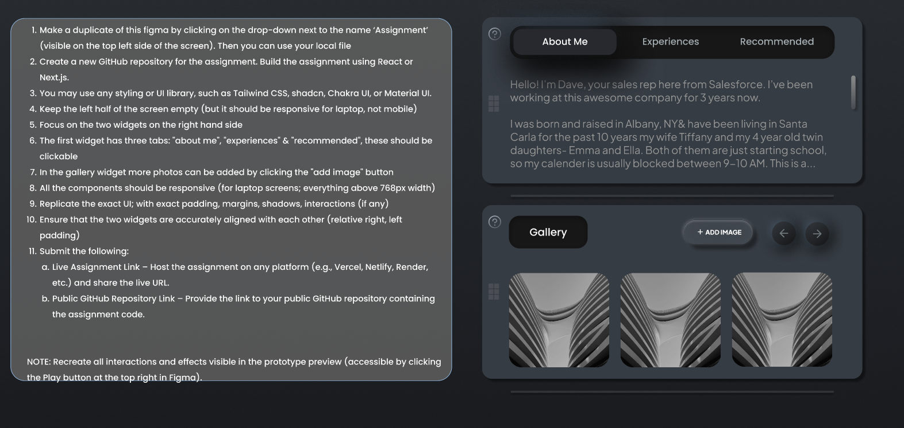
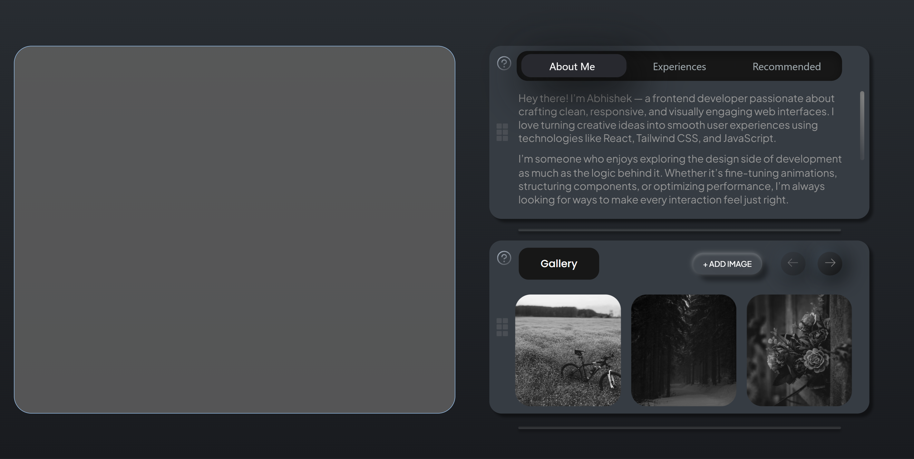

# Internship Assignment – React Widgets UI

This project is my submission for the internship assignment, where the goal was to replicate a Figma prototype using **React**.

---

## 🖥️ Live Demo

🔗 [Live Assignment Link](internasssignment.netlify.app)

---

## 📌 Assignment Overview

- Duplicate the Figma prototype (Assignment file) and use it as reference.
- Build the UI using **React** (or Next.js).
- Use any UI or styling library (Tailwind CSS in this case).
- Focus on two widgets on the right-hand side:
  - **Widget 1:** Three clickable tabs – "About Me", "Experiences", "Recommended".
  - **Widget 2 (Gallery):** Ability to add images dynamically via the **+ Add Image** button.
- Left half of the screen remains empty but responsive for laptops (above 768px width).
- Replicate all **interactions, padding, margins, shadows, and hover effects**.
- Ensure widgets are aligned properly and the layout is responsive.

---

## 🛠️ Tech Stack

- **React.js** – Component-based UI.
- **Tailwind CSS** – Styling and responsive design.
- **Vite** – Development environment.
- **Netlify / Vercel** – Live deployment.

---

## 📸 Screenshot

### Assignment Screenshot

### Project Screenshot

## 

---
